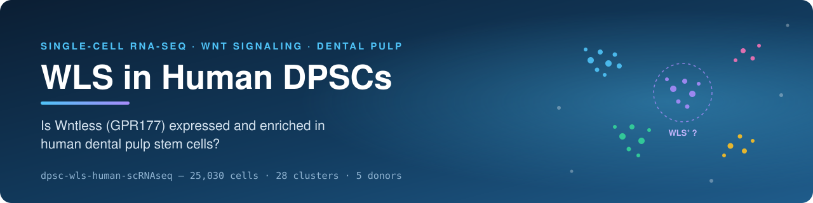
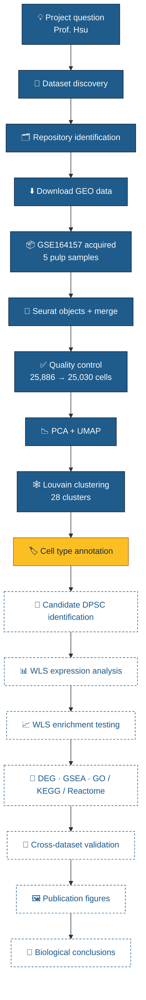
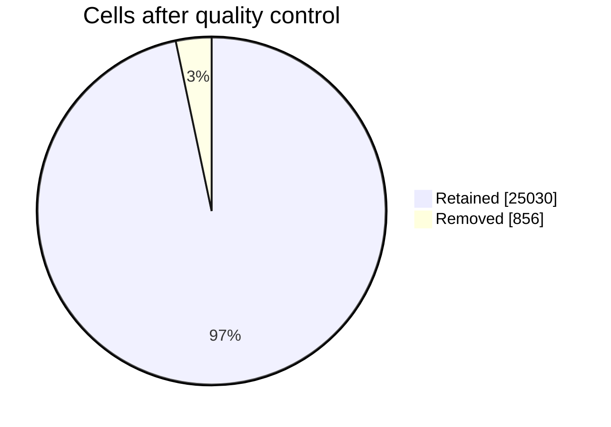
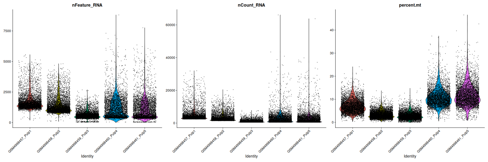
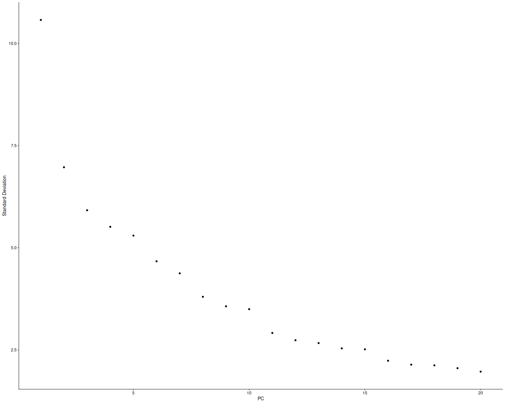
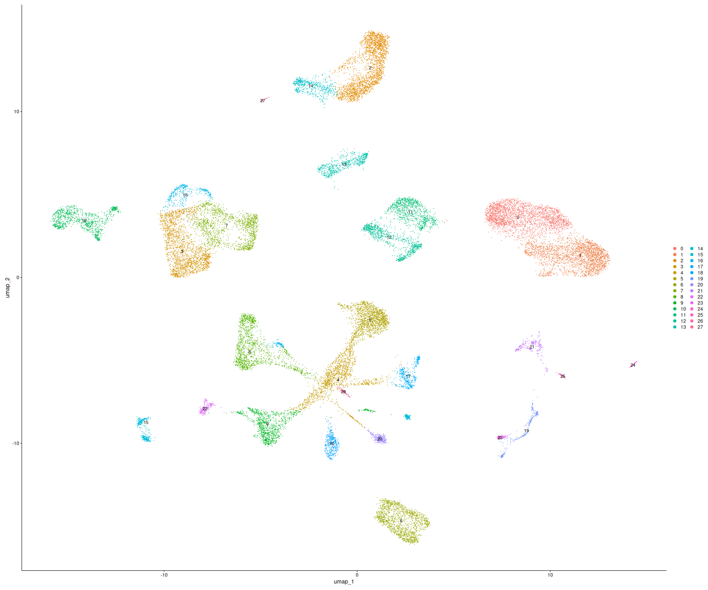
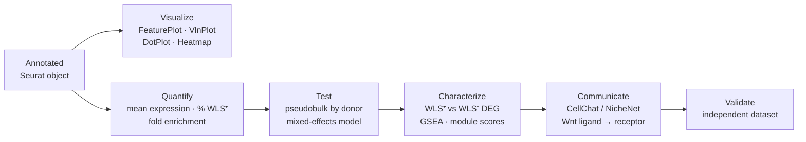

<p align="center">
  
</p>

<p align="center">
  
  
  
  
</p>

<p align="center">
  
  
  
  
  
  
  
</p>

<p align="center">
  <b>A systematic, reproducible single-cell analysis of <i>WLS</i> (Wntless / GPR177) expression in human dental pulp stem cells.</b>
</p>

<p align="center">
  <a href="#-overview">Overview</a> •
  <a href="#-hypotheses">Hypotheses</a> •
  <a href="#-pipeline">Pipeline</a> •
  <a href="#-datasets">Datasets</a> •
  <a href="#-results-so-far">Results</a> •
  <a href="#️-figures">Figures</a> •
  <a href="#-quick-start">Quick start</a> •
  <a href="#-roadmap">Roadmap</a>
</p>

---

## 🔬 Overview

**Dental pulp stem cells (DPSCs)** are multipotent mesenchymal cells in the dental pulp that support dentin repair, wound healing, and tissue homeostasis. **Wnt signaling** is a master regulator of stem cell self-renewal, differentiation, and regeneration, and **WLS (Wntless/GPR177)** is the transmembrane cargo receptor that every Wnt ligand needs in order to be secreted.

Despite several public human dental pulp single-cell datasets, nobody has systematically asked whether WLS is expressed in DPSCs, which pulp cells express it, or whether WLS-positive progenitors carry distinct stemness and Wnt programs. This project answers those questions by reanalyzing original public repositories and validating across independent datasets.

> [!NOTE]
> **Central question** (posed by Prof. Wei Hsu): *Is WLS expressed, and enriched, in human dental pulp stem cells?*

## 🧪 Hypotheses

| | Hypothesis | Primary test |
|:-:|---|---|
| **H1** | WLS is expressed in human DPSCs | Detection and % positive cells in candidate DPSC clusters |
| **H2** | WLS is significantly enriched in DPSCs versus non-DPSC pulp cells | Donor-level pseudobulk and mixed-effects models |
| **H3** | WLS⁺ DPSCs show enhanced Wnt-associated pathway activity | DEG, GSEA, module scores, ligand–receptor inference |

> [!TIP]
> Because WLS controls Wnt **secretion**, WLS⁺ cells are interpreted as Wnt-**producing**. H3 is tested on two axes: ligand-production programs (WNT genes, *PORCN*) and canonical response programs (*AXIN2*, *LEF1*, *TCF7*, *NKD1*, *NOTUM*, *LGR5*).

## 🧭 Pipeline



<sub>🟦 Completed  🟨 Next  ⬜ Planned</sub>

### Stage status

| Stage | Activity | Status |
|:-:|---|:-:|
| 1 | Systematic dataset discovery | ✅ |
| 2 | Repository identification | ✅ |
| 3 | Data acquisition | ✅ *(1 of 4 datasets)* |
| 4 | Single-cell preprocessing | ✅ |
| 5 | Cell clustering | ✅ |
| 6 | DPSC annotation | 🟡 next |
| 7 | WLS expression analysis | ⬜ |
| 8 | Cross-dataset validation | ⬜ |
| 9 | Functional / pathway interpretation | ⬜ |

## 🗃️ Datasets

| Accession | Source | Role | Status |
|---|---|---|---|
| [GSE164157](https://www.ncbi.nlm.nih.gov/geo/query/acc.cgi?acc=GSE164157) | GEO | 🔎 Discovery | ✅ Downloaded and processed |
| [GSE202476](https://www.ncbi.nlm.nih.gov/geo/query/acc.cgi?acc=GSE202476) | GEO | 🔁 Validation candidate | 📝 Metadata review |
| [GSE185222](https://www.ncbi.nlm.nih.gov/geo/query/acc.cgi?acc=GSE185222) | GEO | 🔁 Validation candidate | 📝 Metadata review |
| [PRJNA946721](https://www.ncbi.nlm.nih.gov/bioproject/PRJNA946721) | SRA BioProject | 🧩 Cross-dataset confirmation | 📝 Metadata review |

<details>
<summary><b>GSE164157 sample manifest</b></summary>

| GEO sample | Label | Format |
|---|---|---|
| GSM4998457 | Pulp1 | 10x (`barcodes.tsv.gz`, `genes.tsv.gz`, `matrix.mtx.gz`) |
| GSM4998458 | Pulp2 | 10x |
| GSM4998459 | Pulp3 | 10x |
| GSM4998460 | Pulp4 | 10x |
| GSM4998461 | Pulp5 | 10x |

</details>

## 📊 Results so far

<table>
<tr>
<td width="50%" valign="top">

**Quality control**

| Metric | Value |
|---|---|
| Cells before QC | 25,886 |
| Cells after QC | **25,030** |
| Cells removed | 856 (3.3%) |
| Features | 45,076 |

Filters: `nFeature_RNA > 200`, `nCount_RNA > 500`, `percent.mt < 20`

</td>
<td width="50%" valign="top">

**Graph-based clustering**

| Metric | Value |
|---|---|
| Nodes (cells) | 25,030 |
| SNN edges | 977,919 |
| Communities | **28** |
| Max. modularity | 0.9558 |

Method: SNN graph + Louvain

</td>
</tr>
</table>



> [!IMPORTANT]
> High modularity shows a well-separated neighbor graph, not proof that every cluster is a distinct cell type. Annotation, batch inspection, and doublet removal come before biological interpretation.

## 🖼️ Figures

### Figure 1 · Quality control metrics by sample

<p align="center">
  
</p>

The five samples differ clearly in quality profile.

- **Pulp1 and Pulp2** have the richest libraries, with a median of roughly 1,000–1,500 genes per cell. Pulp2 also has low mitochondrial content (~3%).
- **Pulp3** has the lowest complexity (median ~500 genes, low UMI counts) but low mitochondrial content.
- **Pulp4 and Pulp5** have the highest mitochondrial fractions (median ~10%, tails above 40%) and a large population of low-gene cells, alongside a minority of very high-count cells.

The plot shows cells before filtering. The `percent.mt < 20` cut-off mainly removes cells from Pulp4 and Pulp5. Because the distributions differ this much between samples, sample-specific effects are likely, which supports checking the UMAP by sample and integrating if needed. The high-count tails in Pulp4 and Pulp5 are worth screening for doublets.

### Figure 2 · PCA elbow plot

<p align="center">
  
</p>

Standard deviation drops steeply over PC1–PC3, then declines gradually until about PC10–PC11, and flattens from about PC15 onward. The first 15–20 PCs therefore capture most of the structured variation. Only 20 PCs are shown and the curve is still sloping slightly at PC20, so computing 30–50 PCs, or using `JackStraw` or variance-explained thresholds, would confirm where the plateau lies. The number of PCs chosen should be recorded in `05_clustering.R`.

### Figure 3 · UMAP of 28 Louvain clusters

<p align="center">
  
</p>

The UMAP resolves 25,030 cells into well-separated islands. The largest groups are:

- clusters **0/1** on the right
- clusters **2/14** at the top
- clusters **3/7/16** on the left
- clusters **11/12** in the center
- an isolated cluster **6** at the bottom
- a branched structure centered on cluster **4**, connecting clusters 5, 8, 9 and 20

There are also several small satellite populations: clusters 15, 17–19 and 21–27. The branched "hub" around cluster 4 could reflect a differentiation continuum, which is of interest for progenitor states. It could also reflect low-quality or doublet cells bridging real populations, which needs checking with QC metrics per cluster.

Cell types have **not** been assigned yet. Next steps are `DimPlot(group.by = "sample")` to test for batch-driven clusters, then marker-based annotation to locate candidate DPSC/perivascular populations and map *WLS*.

## 🦷 Annotation markers

Candidate DPSC / pulp progenitor populations will be identified by **marker combinations** rather than any single gene.

| Marker | Alias | Expected signal |
|---|---|---|
| `THY1` | CD90 | Mesenchymal stromal |
| `NT5E` | CD73 | Mesenchymal stromal |
| `ENG` | CD105 | Mesenchymal stromal |
| `MCAM` | CD146 | Perivascular progenitor niche |
| `PDGFRB` | — | Perivascular / mural |
| `CXCL12` | SDF-1 | Stromal niche |
| `COL1A1` | — | Fibroblast / odontoblast lineage |
| **`WLS`** | **GPR177** | **Target gene** |

## 📁 Repository structure

```text
dpsc-wls-human-scRNAseq/
├── data/            # raw and processed data (not tracked)
├── docs/            # reports and notes
├── environment/     # environment files
├── logs/            # run logs
├── references/      # literature
├── assets/          # banner and README figures
├── results/         # figures and tables
├── scripts/
│   ├── 00_install_packages.R    ✅
│   ├── 01_dataset_discovery.R   ✅
│   ├── 02_download_GEO.R        ✅
│   ├── 03_download_SRA.sh       📝
│   ├── 04_QC.R                  ✅
│   ├── 05_clustering.R          ✅
│   ├── 06a_batch_doublets.R     ✅
│   ├── 06_annotation.R          ✅
│   ├── 07_WLS_expression.R      ✅
│   ├── 07b_WLS_sensitivity.R    ✅
│   ├── 08_DEG.R                 ⬜
│   └── 09_GSEA.R                ⬜
├── renv.lock
└── README.md
```

## 🚀 Quick start

```bash
# 1. Clone
git clone https://github.com/<your-username>/dpsc-wls-human-scRNAseq.git
cd dpsc-wls-human-scRNAseq

# 2. Restore the exact R environment
Rscript -e 'install.packages("renv"); renv::restore()'

# 3. Run the pipeline
Rscript scripts/02_download_GEO.R      # fetch GSE164157
Rscript scripts/04_QC.R                # load, merge, filter
Rscript scripts/05_clustering.R        # PCA, UMAP, Louvain
```

> [!WARNING]
> Run shell commands (`touch`, `bash`, `git`) in a **terminal**, not inside the R console.

## 📐 Analysis plan for WLS



**Statistics.** Donors, not cells, are the unit of replication. Cell-level Wilcoxon tests are used only for exploration, while inference relies on donor-level pseudobulk (edgeR/DESeq2) and mixed-effects models, with effect sizes and Benjamini–Hochberg correction.

## ⚠️ Methodological notes

- **Batch effects.** The five samples are merged but not integrated yet. Check UMAP by sample and apply Harmony or Seurat integration if clusters split by donor.
- **Sample tracking.** Use `add.cell.ids` in `merge()` so every barcode is traceable to its donor.
- **Feature count.** 45,076 features exceeds a typical 10x human reference. Verify that `genes.tsv` is consistent across samples and that `WLS` (ENSG00000116729) appears once.
- **Doublets and ambient RNA.** Run scDblFinder/DoubletFinder and consider SoupX before making claims about WLS specificity.
- **DPSC definition.** In tissue data, report *candidate pulp stem/progenitor* populations defined by marker combinations.

<details>
<summary><b>🛠️ Troubleshooting log</b></summary>

| Issue | Cause | Fix |
|---|---|---|
| `touch` fails in R | Shell command in R console | Run in terminal |
| `libuv was not found` | Missing system dependency | Install `fs`, then continue setup |
| `there is no package called 'GEOquery'` | Not installed | `BiocManager::install("GEOquery")` |
| `unexpected end of input` | Incomplete call | Fix syntax |
| `Feature names cannot have underscores` | Seurat naming rule | Safe to ignore |
| Duplicate cell names | Shared barcodes across samples | Auto-handled; prefer `add.cell.ids` |

</details>

## 🗺️ Roadmap

- [x] Project structure, Git repository, renv environment
- [x] Dataset discovery and GEO download (GSE164157)
- [x] Load, merge, and QC five pulp samples
- [x] PCA, UMAP, and Louvain clustering (28 clusters)
- [x] Batch inspection, integration, and doublet removal
- [x] Cell type annotation and candidate DPSC identification
- [x] WLS visualization and quantification
- [x] Donor-level WLS enrichment testing
- [x] Sensitivity analysis (4 DPSC definitions, depth-adjusted co-expression)
- [ ] WLS⁺ vs WLS⁻ DEG, GSEA, and ligand–receptor analysis
- [ ] Cross-dataset validation
- [ ] Publication-quality figures

## 👥 Team

| Role | Name |
|---|---|
| Investigator | **Md Tariqul Islam** |
| Supervisor | **Professor Wei Hsu** |

## 🙏 Acknowledgments

Thanks to the authors of the original dental pulp single-cell studies for depositing their data publicly, and to the developers of Seurat, Bioconductor, GEOquery, and renv.

## 📖 Citation

If you use this workflow, please cite this repository and the original publications associated with each dataset.

```bibtex
@misc{islam2026wlsdpsc,
  author = {Islam, Md Tariqul and Hsu, Wei},
  title  = {Systematic Single-Cell Analysis of WLS (GPR177/Wntless) Expression in Human Dental Pulp Stem Cells},
  year   = {2026},
  howpublished = {\url{https://github.com/<your-username>/dpsc-wls-human-scRNAseq}}
}
```

---

<p align="center">
  <sub>Last updated: October 1, 2026 · Built with 🧬 R, Seurat and a lot of single cells</sub>
</p>
